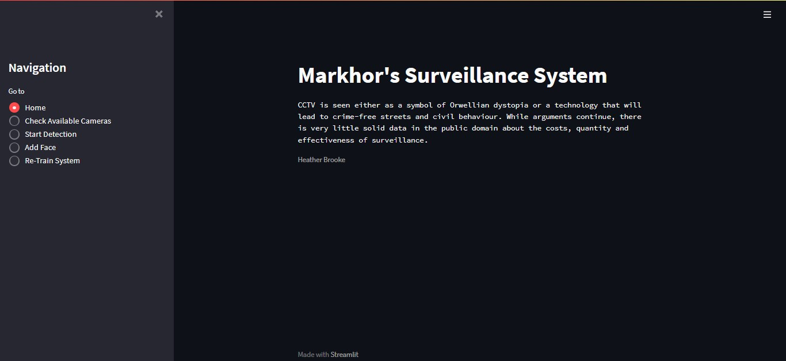

# Markhor's Surveillance System

This is a quick guide of how to install and run this web-application.

To install:
'''
git clone https://github.com/mohammadameenbarech/MarkhorSurveillanceSystem
'''
Install requirements:
'''
pip install -r requirements.txt
'''
Run it on Streamlit:
'''
streamlit run main.py
'''

  
As the Facenet model was trained on older versions of TensorFlow, the architecture.py file is used to define the model's architecture on newer versions of TensorFlow so that the pre-trained model's weight can be loaded. 

 Dowload pre-trained weight from [Here.👈](https://drive.google.com/drive/folders/1scGoVCQp-cNwKTKOUqevCP1N2LlyXU3l?usp=sharing)  
For in depth explanation follow this amazingly expained [article. 👈](https://arsfutura.com/magazine/face-recognition-with-facenet-and-mtcnn/)

### Credit: https://github.com/R4j4n/Face-recognition-Using-Facenet-On-Tensorflow-2.X
